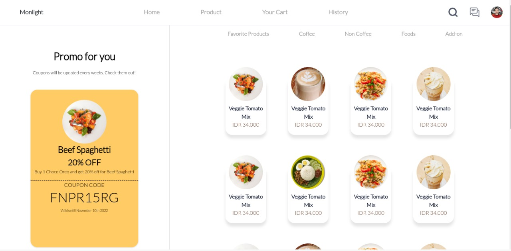
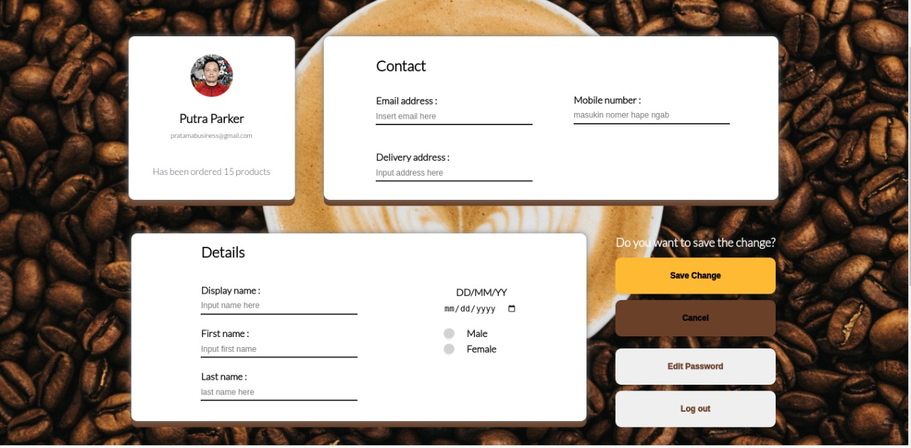
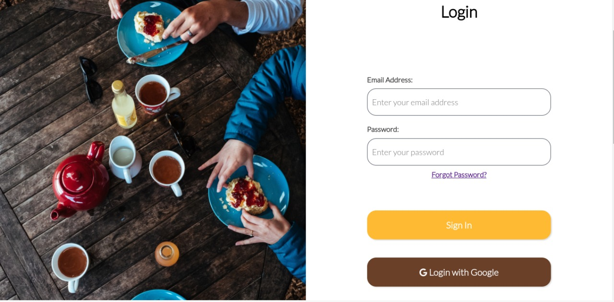

<h1 align="center">Monlight Cafe</h1>

  Built with Bootstrap.

## Table of Contents

- [Introduction](#introduction)
- [Features](#features)
- [Requirements](#requirements)
- [Usage](#usage-for-development)
- [Screenshots](#screenshots)
- [Related Project](#related-project-backend)
- [Contributors](#contributors)

## Introduction
<b>Monlight Apps</b> is an Web-Apps for Monlight Cafe. 
## Features
* Order feature for customer
* Admin feature
* Payment feature
* And others

## Requirements
* [`bootstrap`](https://getbootstrap.com/)

## Usage for development
1. Open your terminal or command prompt
2. Type `git clone `
3. Open with your text editor
4. Start to edit and develop

## Screenshots

       
    
    

## Previous Project
* [`Backend Monlight Cafe`](https://github.com/rzkiyprtm/monlight.git)

## Contributors

  <table>
    <tr>
      <td align="center">
        <a href="https://github.com/rzkiyprtm">
           
          <b>Rizky Putra Pratama</b>
        </a>
      </td>
    </tr>
  </table>

